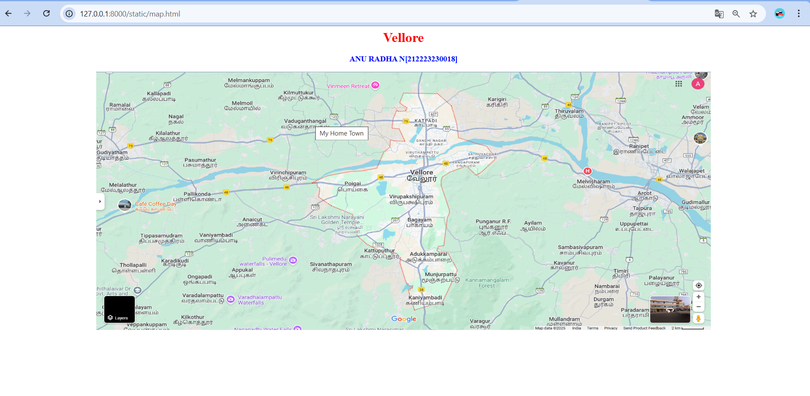
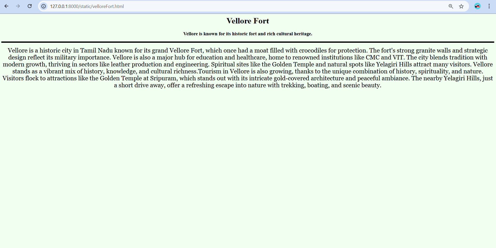
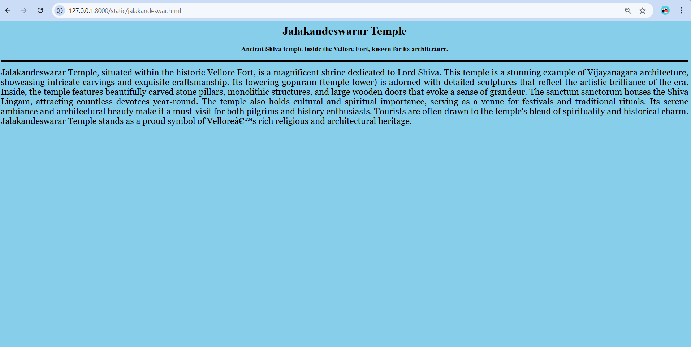
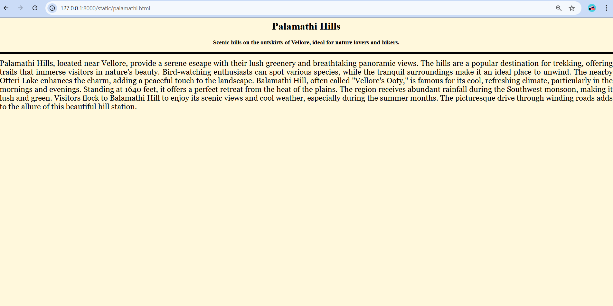

# Ex04 Places Around Me
## Date: 

## AIM:
To develop a website to display details about the places around my house.

## DESIGN STEPS

### STEP 1
Create a Django admin interface.

### STEP 2
Download your city map from Google.

### STEP 3
Using ```<map>``` tag name the map.

### STEP 4
Create clickable regions in the image using ```<area>``` tag.

### STEP 5
Write HTML programs for all the regions identified.

### STEP 6
Execute the programs and publish them.

## CODE
```

map.html

<html> 
<head> 
    <title>My City</title> 
</head> 
<body> 
    <h1 align="center">
        <font color="red"><b>Vellore</b></font>
    </h1> 
    <h3 align="center">
        <font color="blue"><b>ANU RADHA N</b>[212223230018]</b></font>
    </h3> 
    <center>
         
        <map name="MyCity"> 
            <area shape="rect" coords="100,100,900,900" href="home.html" title="My Home Town">

            <map name="image-map">
                <area shape="rect" alt="Vellore Fort" coords="700,681,1022,0" href="./velloreFort.html" title="Vellore Fort" >
                <area shape="rect" alt="Jalakandeswarar"  coords="1077,0,0,808"  href="./jalakandeswar.html" title="Jalakandeswarar" >
                <area tshape="rect" alt="Palamathi Hills"  coords="-1,0,770,1214"  href="./palamathi.html" title="Palamathi Hills">
            </map>    
        </map>
    </center> 
</body> 
</html>


```
```

velloreFort.html


<html>
    <head>
        <title>Vellore Fort </title>
    </head>
   
    <body bgcolor="#F0FFF0">
        <h1 align="center">
            <font color="black"><b>Vellore Fort</b></font>
        </h1>
        <h3 align="center">
            <font color="black"><b>Vellore is known for its historic fort and rich cultural heritage.</b></font>
        </h3>
       
        <hr size="5" color="black" >
        <p align="center">
            <font face="Georgia" size="5">
                Vellore is a historic city in Tamil Nadu known for its grand Vellore Fort, which once had a moat filled with crocodiles for protection. The fort's strong granite walls and strategic design reflect its military importance. Vellore is also a major hub for education and healthcare, home to renowned institutions like CMC and VIT. The city blends tradition with modern growth, thriving in sectors like leather production and engineering. Spiritual sites like the Golden Temple and natural spots like Yelagiri Hills attract many visitors. Vellore stands as a vibrant mix of history, knowledge, and cultural richness.Tourism in Vellore is also growing, thanks to the unique combination of history, spirituality, and nature. Visitors flock to attractions like the Golden Temple at Sripuram, which stands out with its intricate gold-covered architecture and peaceful ambiance. The nearby Yelagiri Hills, just a short drive away, offer a refreshing escape into nature with trekking, boating, and scenic beauty.
            </font>
        </p>
    
    </body>
</html>

```

```
jalakandeswar.html


<html>
    <head>
        <title>Jalakandeswarar Temple</title>
    </head>
   
    <body bgcolor="skyblue">
        <h1 align="center">
            <font color="black"><b>Jalakandeswarar Temple</b></font>
        </h1>
        <h3 align="center">
            <font color="black"><b>Ancient Shiva temple inside the Vellore Fort, known for its architecture.</b></font>
        </h3>
       
        <hr size="5" color="black">
        <p align="justify">
            <font face="Georgia" size="5">
                Jalakandeswarar Temple, situated within the historic Vellore Fort, is a magnificent shrine dedicated to Lord Shiva. This temple is a stunning example of Vijayanagara architecture, showcasing intricate carvings and exquisite craftsmanship. Its towering gopuram (temple tower) is adorned with detailed sculptures that reflect the artistic brilliance of the era. Inside, the temple features beautifully carved stone pillars, monolithic structures, and large wooden doors that evoke a sense of grandeur. The sanctum sanctorum houses the Shiva Lingam, attracting countless devotees year-round. The temple also holds cultural and spiritual importance, serving as a venue for festivals and traditional rituals. Its serene ambiance and architectural beauty make it a must-visit for both pilgrims and history enthusiasts. Tourists are often drawn to the temple's blend of spirituality and historical charm. Jalakandeswarar Temple stands as a proud symbol of Vellore’s rich religious and architectural heritage.            </font>
        </p>
        
    </body>
</html>

```

```
palamathi.html


<html>
    <head>
        <title>Palamathi Hills</title>
    </head>
   
    <body bgcolor="#FFF8DC">
        <h1 align="center">
            <font color="black"><b>Palamathi Hills</b></font>
        </h1>
        <h3 align="center">
            <font color="black"><b>Scenic hills on the outskirts of Vellore, ideal for nature lovers and hikers. </b></font>
        </h3>
       
        <hr size="5" color="black">
        <p align="justify">
            <font face="Georgia" size="5">
                Palamathi Hills, located near Vellore, provide a serene escape with their lush greenery and breathtaking panoramic views. The hills are a popular destination for trekking, offering trails that immerse visitors in nature's beauty. Bird-watching enthusiasts can spot various species, while the tranquil surroundings make it an ideal place to unwind. The nearby Otteri Lake enhances the charm, adding a peaceful touch to the landscape. Balamathi Hill, often called "Vellore's Ooty," is famous for its cool, refreshing climate, particularly in the mornings and evenings. Standing at 1640 feet, it offers a perfect retreat from the heat of the plains. The region receives abundant rainfall during the Southwest monsoon, making it lush and green. Visitors flock to Balamathi Hill to enjoy its scenic views and cool weather, especially during the summer months. The picturesque drive through winding roads adds to the allure of this beautiful hill station.            </font>
            
            
        </p>
        
    </body>
</html>


```

## OUTPUT:










## RESULT:
The program for implementing image maps using HTML is executed successfully.
